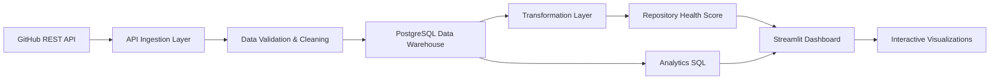
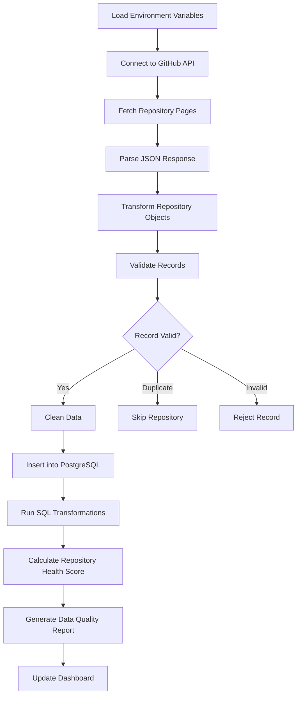
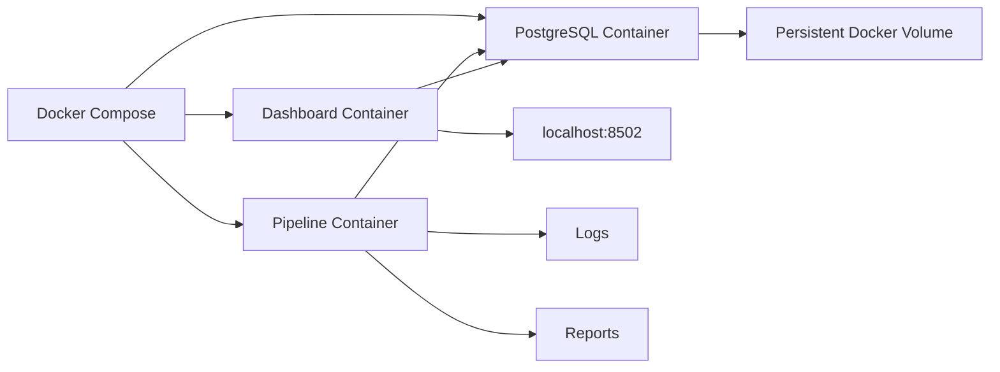

# 🚀 DataPulse – GitHub Repository Intelligence Platform


---

## 📌 Internship Project

**Program:** Futurense Summer Internship 2026

**Track:** Foundations of Data Engineering (Hero Project)

**Project Name:** DataPulse – GitHub Repository Intelligence Platform

**Duration:** Week 1 – Week 5

---

# 📖 Project Overview

DataPulse is a production-style Data Engineering project that collects repository information from the GitHub REST API, validates and cleans the data, stores it inside a PostgreSQL data warehouse, transforms the data into analytics-ready datasets, computes repository health metrics, and visualizes everything through an interactive Streamlit dashboard.

Instead of treating GitHub repositories as isolated API responses, DataPulse builds a complete ETL pipeline capable of collecting, validating, storing, transforming, analysing and visualizing repository intelligence.

The project demonstrates an end-to-end modern Data Engineering workflow including API integration, warehouse design, SQL analytics, data quality engineering, dashboard development, Docker containerization and project documentation.

---

# 🎯 Project Objectives

The primary objective of this project is to design and implement an end-to-end Data Engineering solution capable of transforming raw GitHub repository metadata into meaningful analytical insights.

The project aims to:

- Build a modular ETL pipeline
- Collect repository metadata from GitHub REST API
- Store structured data inside PostgreSQL
- Implement automated data quality validation
- Clean inconsistent repository data
- Build reusable transformation modules
- Generate repository analytics
- Design Repository Health Score
- Create an interactive analytics dashboard
- Containerize the entire application using Docker
- Write production-quality documentation
- Demonstrate industry-standard Data Engineering practices

---

# ❓ Problem Statement

GitHub hosts millions of open-source repositories. Developers and organizations often struggle to understand repository quality, popularity and maintenance status because repository information is distributed across numerous API endpoints.

Questions such as:

- Which repositories are the most active?
- Which repositories receive the most community support?
- Which repositories are becoming inactive?
- Which repositories require maintenance?
- Which programming languages dominate an organization?

cannot easily be answered through the GitHub interface alone.

DataPulse addresses this challenge by building a centralized analytical warehouse that converts GitHub repository metadata into actionable insights.

---

# 💼 Business Use Case

Organizations managing hundreds or thousands of repositories require automated reporting rather than manually inspecting every repository.

DataPulse enables organizations to:

- Monitor repository growth
- Measure repository popularity
- Identify inactive projects
- Detect unhealthy repositories
- Understand language distribution
- Track repository statistics
- Improve engineering decision-making

The project demonstrates how modern data engineering pipelines support business intelligence and operational reporting.

---

# 📅 Internship Journey

This repository represents the complete five-week Hero Project developed during the Futurense Summer Internship.

Instead of building everything at once, the project evolved incrementally every week by introducing new Data Engineering concepts.

---

# ✅ Week 1 — Foundation & ETL Pipeline

During Week 1, the primary focus was establishing the core architecture of the project.

### Completed

- Project initialization
- Modular project architecture
- GitHub REST API integration
- Authentication using Personal Access Token
- Repository metadata ingestion
- PostgreSQL database integration
- SQLAlchemy ORM models
- Environment configuration
- Logging system
- Initial ETL workflow
- Configuration management
- Error handling

### Outcome

A reusable ETL pipeline capable of ingesting GitHub repositories into PostgreSQL.

---

# ✅ Week 2 — Data Warehouse & Analytics

Week 2 expanded the project into a complete warehouse and analytics platform.

### Completed

- Multi-repository ingestion
- Warehouse optimization
- SQL analytics queries
- Repository statistics
- Data transformation layer
- Repository metrics
- Aggregation functions
- Performance improvements
- Modular analytics components

### Outcome

Repository information became analytics-ready for reporting and dashboarding.

---

# ✅ Week 3 — Repository Health Score

Week 3 introduced intelligent repository evaluation.

### Completed

- Repository Health Score algorithm
- Score normalization
- Health categorization
- Ranking repositories
- Repository comparison
- Health analytics
- SQL integration
- Dashboard integration

### Outcome

Repositories can now be compared using a single numerical health indicator rather than individual statistics.

---

# ✅ Week 4 — Data Quality Engineering

Week 4 focused on production-grade data quality.

### Completed

- Data validation framework
- Data cleaning pipeline
- Duplicate detection
- Invalid record detection
- Missing value handling
- Automated quality reports
- Streamlit dashboard
- Interactive visualizations
- Dashboard analytics pages

### Outcome

The project evolved from an ETL pipeline into a complete analytics platform capable of validating, cleaning and visualizing repository intelligence.

---

# ✅ Week 5 — Final Production Readiness

The final week focused on transforming the project into a professional portfolio-ready application.

### Completed

- Docker containerization
- Docker Compose orchestration
- Documentation improvements
- Architecture documentation
- Deployment preparation
- Project cleanup
- Professional README
- Reflection documentation
- Future roadmap
- Resume bullet preparation
- Repository polishing

### Outcome

DataPulse became a production-style portfolio project demonstrating the complete lifecycle of a modern Data Engineering application.

---

# ⭐ Key Features

## Data Ingestion

- GitHub REST API integration
- Personal Access Token authentication
- User repositories
- Organization repositories
- Pagination support
- Automatic request handling
- Configurable repository selection

---

## Data Warehouse

- PostgreSQL database
- SQLAlchemy ORM
- Normalized schema
- Duplicate prevention
- Repository persistence
- Transaction management

---

## Data Quality Engineering

- Missing value detection
- Duplicate repository detection
- Duplicate ID detection
- Invalid URL detection
- Invalid timestamps
- Invalid numeric values
- Automatic data cleaning
- Data quality reports

---

## Analytics

- Repository statistics
- Repository rankings
- Language analysis
- Size distribution
- Health distribution
- Activity metrics
- SQL reporting

---

## Repository Health Score

- Health score calculation
- Repository ranking
- Health categorization
- Popularity measurement
- Activity evaluation
- Dashboard visualization

---

## Dashboard

Interactive Streamlit dashboard providing:

- KPI cards
- Repository tables
- Charts
- Health dashboards
- Analytics reports
- Data quality reports

---

## DevOps

- Docker
- Docker Compose
- Environment configuration
- Modular architecture
- Logging
- Automated testing

---

# 🌟 Project Highlights

✔ End-to-End ETL Pipeline

✔ Production-style Folder Structure

✔ PostgreSQL Data Warehouse

✔ SQLAlchemy ORM

✔ Data Quality Framework

✔ Repository Health Score

✔ Analytics SQL

✔ Streamlit Dashboard

✔ Docker Containerization

✔ Automated Testing

✔ Professional Documentation

✔ Portfolio Ready

---

# 📷 Project Preview

Screenshots of the dashboard, architecture diagrams and Docker deployment are included in the **assets/** directory.
# 🚀 DataPulse – GitHub Repository Intelligence Platform


---

## 📌 Internship Project

**Program:** Futurense Summer Internship 2026

**Track:** Foundations of Data Engineering (Hero Project)

**Project Name:** DataPulse – GitHub Repository Intelligence Platform

**Duration:** Week 1 – Week 5

---

# 📖 Project Overview

DataPulse is a production-style Data Engineering project that collects repository information from the GitHub REST API, validates and cleans the data, stores it inside a PostgreSQL data warehouse, transforms the data into analytics-ready datasets, computes repository health metrics, and visualizes everything through an interactive Streamlit dashboard.

Instead of treating GitHub repositories as isolated API responses, DataPulse builds a complete ETL pipeline capable of collecting, validating, storing, transforming, analysing and visualizing repository intelligence.

The project demonstrates an end-to-end modern Data Engineering workflow including API integration, warehouse design, SQL analytics, data quality engineering, dashboard development, Docker containerization and project documentation.

---

# 🎯 Project Objectives

The primary objective of this project is to design and implement an end-to-end Data Engineering solution capable of transforming raw GitHub repository metadata into meaningful analytical insights.

The project aims to:

- Build a modular ETL pipeline
- Collect repository metadata from GitHub REST API
- Store structured data inside PostgreSQL
- Implement automated data quality validation
- Clean inconsistent repository data
- Build reusable transformation modules
- Generate repository analytics
- Design Repository Health Score
- Create an interactive analytics dashboard
- Containerize the entire application using Docker
- Write production-quality documentation
- Demonstrate industry-standard Data Engineering practices

---

# ❓ Problem Statement

GitHub hosts millions of open-source repositories. Developers and organizations often struggle to understand repository quality, popularity and maintenance status because repository information is distributed across numerous API endpoints.

Questions such as:

- Which repositories are the most active?
- Which repositories receive the most community support?
- Which repositories are becoming inactive?
- Which repositories require maintenance?
- Which programming languages dominate an organization?

cannot easily be answered through the GitHub interface alone.

DataPulse addresses this challenge by building a centralized analytical warehouse that converts GitHub repository metadata into actionable insights.

---

# 💼 Business Use Case

Organizations managing hundreds or thousands of repositories require automated reporting rather than manually inspecting every repository.

DataPulse enables organizations to:

- Monitor repository growth
- Measure repository popularity
- Identify inactive projects
- Detect unhealthy repositories
- Understand language distribution
- Track repository statistics
- Improve engineering decision-making

The project demonstrates how modern data engineering pipelines support business intelligence and operational reporting.

---

# 📅 Internship Journey

This repository represents the complete five-week Hero Project developed during the Futurense Summer Internship.

Instead of building everything at once, the project evolved incrementally every week by introducing new Data Engineering concepts.

---

# ✅ Week 1 — Foundation & ETL Pipeline

During Week 1, the primary focus was establishing the core architecture of the project.

### Completed

- Project initialization
- Modular project architecture
- GitHub REST API integration
- Authentication using Personal Access Token
- Repository metadata ingestion
- PostgreSQL database integration
- SQLAlchemy ORM models
- Environment configuration
- Logging system
- Initial ETL workflow
- Configuration management
- Error handling

### Outcome

A reusable ETL pipeline capable of ingesting GitHub repositories into PostgreSQL.

---

# ✅ Week 2 — Data Warehouse & Analytics

Week 2 expanded the project into a complete warehouse and analytics platform.

### Completed

- Multi-repository ingestion
- Warehouse optimization
- SQL analytics queries
- Repository statistics
- Data transformation layer
- Repository metrics
- Aggregation functions
- Performance improvements
- Modular analytics components

### Outcome

Repository information became analytics-ready for reporting and dashboarding.

---

# ✅ Week 3 — Repository Health Score

Week 3 introduced intelligent repository evaluation.

### Completed

- Repository Health Score algorithm
- Score normalization
- Health categorization
- Ranking repositories
- Repository comparison
- Health analytics
- SQL integration
- Dashboard integration

### Outcome

Repositories can now be compared using a single numerical health indicator rather than individual statistics.

---

# ✅ Week 4 — Data Quality Engineering

Week 4 focused on production-grade data quality.

### Completed

- Data validation framework
- Data cleaning pipeline
- Duplicate detection
- Invalid record detection
- Missing value handling
- Automated quality reports
- Streamlit dashboard
- Interactive visualizations
- Dashboard analytics pages

### Outcome

The project evolved from an ETL pipeline into a complete analytics platform capable of validating, cleaning and visualizing repository intelligence.

---

# ✅ Week 5 — Final Production Readiness

The final week focused on transforming the project into a professional portfolio-ready application.

### Completed

- Docker containerization
- Docker Compose orchestration
- Documentation improvements
- Architecture documentation
- Deployment preparation
- Project cleanup
- Professional README
- Reflection documentation
- Future roadmap
- Resume bullet preparation
- Repository polishing

### Outcome

DataPulse became a production-style portfolio project demonstrating the complete lifecycle of a modern Data Engineering application.

---

# ⭐ Key Features

## Data Ingestion

- GitHub REST API integration
- Personal Access Token authentication
- User repositories
- Organization repositories
- Pagination support
- Automatic request handling
- Configurable repository selection

---

## Data Warehouse

- PostgreSQL database
- SQLAlchemy ORM
- Normalized schema
- Duplicate prevention
- Repository persistence
- Transaction management

---

## Data Quality Engineering

- Missing value detection
- Duplicate repository detection
- Duplicate ID detection
- Invalid URL detection
- Invalid timestamps
- Invalid numeric values
- Automatic data cleaning
- Data quality reports

---

## Analytics

- Repository statistics
- Repository rankings
- Language analysis
- Size distribution
- Health distribution
- Activity metrics
- SQL reporting

---

## Repository Health Score

- Health score calculation
- Repository ranking
- Health categorization
- Popularity measurement
- Activity evaluation
- Dashboard visualization

---

## Dashboard

Interactive Streamlit dashboard providing:

- KPI cards
- Repository tables
- Charts
- Health dashboards
- Analytics reports
- Data quality reports

---

## DevOps

- Docker
- Docker Compose
- Environment configuration
- Modular architecture
- Logging
- Automated testing

---

# 🌟 Project Highlights

✔ End-to-End ETL Pipeline

✔ Production-style Folder Structure

✔ PostgreSQL Data Warehouse

✔ SQLAlchemy ORM

✔ Data Quality Framework

✔ Repository Health Score

✔ Analytics SQL

✔ Streamlit Dashboard

✔ Docker Containerization

✔ Automated Testing

✔ Professional Documentation

✔ Portfolio Ready

---

# 📷 Project Preview

Screenshots of the dashboard, architecture diagrams and Docker deployment are included in the **assets/** directory.

---

# 🏗️ System Architecture

DataPulse follows a modular Data Engineering architecture where each component performs a specific responsibility within the ETL workflow. The project separates ingestion, validation, storage, transformation, analytics, and visualization into independent modules to improve maintainability and scalability.

The overall workflow consists of:

1. Collect repository metadata from the GitHub REST API.
2. Validate and clean the incoming data.
3. Store validated records in PostgreSQL.
4. Transform raw data into analytics-ready datasets.
5. Calculate Repository Health Scores.
6. Execute analytical SQL queries.
7. Display insights through an interactive Streamlit dashboard.

---

# 🏛 High-Level Architecture



---

# 🔄 Complete ETL Pipeline



---

# 🐳 Docker Architecture



---

# 📊 Project Workflow

```text
GitHub REST API
        │
        ▼
Repository Ingestion
        │
        ▼
Data Validation
        │
        ▼
Data Cleaning
        │
        ▼
Duplicate Detection
        │
        ▼
PostgreSQL Warehouse
        │
        ▼
Transformation Layer
        │
        ▼
Repository Health Score
        │
        ▼
Analytics SQL
        │
        ▼
Streamlit Dashboard
```

---

# 🗄 Database Design

The PostgreSQL warehouse stores repository metadata collected from GitHub.

Typical repository information includes:

- Repository ID
- Repository Name
- Owner
- Description
- Language
- Stars
- Forks
- Watchers
- Open Issues
- Repository Size
- Visibility
- Default Branch
- Repository URL
- Created Date
- Updated Date
- Last Push Date

The database serves as the central warehouse from which all analytics and dashboard visualizations are generated.

---

# 🛠 Technology Stack

| Category | Technology |
|-----------|------------|
| Programming Language | Python 3.13 |
| API Source | GitHub REST API |
| Database | PostgreSQL 16 |
| ORM | SQLAlchemy |
| Dashboard | Streamlit |
| Data Processing | Pandas |
| Visualization | Plotly |
| Environment | python-dotenv |
| Testing | pytest |
| Containerization | Docker |
| Orchestration | Docker Compose |
| Version Control | Git |
| Repository Hosting | GitHub |

---

# 📁 Project Structure

```text
DataPulse/

├── assets/
│   ├── dashboard_home.png
│   ├── dashboard_health.png
│   ├── dashboard_quality.png
│   └── architecture.png
│
├── config/
│
├── dashboard/
│   ├── streamlit_app.py
│   └── pages/
│
├── database/
│
├── docs/
│   ├── adr/
│   ├── architecture.md
│   ├── DEPLOYMENT.md
│   ├── reflection.md
│   ├── roadmap_3rd_year.md
│   ├── resume_bullets.md
│   └── mock_interview.md
│
├── extensions/
│
├── ingestion/
│
├── logs/
│
├── quality/
│
├── reports/
│
├── sql/
│
├── tests/
│
├── transformations/
│
├── utils/
│
├── Dockerfile
├── docker-compose.yml
├── requirements.txt
├── README.md
└── .env.example
```

---

# ⚙️ ETL Components

## 1. Data Extraction

The ingestion module connects to the GitHub REST API using a Personal Access Token and retrieves repository metadata.

Capabilities include:

- Repository retrieval
- Organization support
- User support
- Automatic pagination
- Authentication
- Error handling
- Rate-limit awareness

---

## 2. Data Transformation

Raw API responses are transformed into structured Python objects before persistence.

Transformation includes:

- Data normalization
- Type conversion
- Timestamp parsing
- Repository formatting
- Schema mapping

---

## 3. Data Validation

Every repository passes through the validation framework.

Validation checks include:

- Missing repository names
- Missing URLs
- Duplicate repository IDs
- Invalid repository links
- Invalid dates
- Negative statistics
- Empty owner names

Only valid repositories continue through the pipeline.

---

## 4. Data Cleaning

The cleaning layer automatically improves data quality by:

- Removing unnecessary whitespace
- Filling missing descriptions
- Standardizing repository names
- Replacing missing languages
- Formatting timestamps
- Preparing consistent warehouse records

---

## 5. Data Loading

Validated repositories are inserted into PostgreSQL.

The loading process ensures:

- Duplicate protection
- Transaction safety
- Consistent schema
- Reliable persistence

---

# ✅ Data Quality Framework

One of the major improvements introduced during Week 4 was the implementation of a comprehensive Data Quality Framework.

The framework performs validation before any repository enters the warehouse.

## Validation Checks

- Missing values
- NULL values
- Duplicate repositories
- Duplicate IDs
- Invalid URLs
- Invalid dates
- Empty repository names
- Negative stars
- Negative forks
- Negative watchers

---

## Cleaning Operations

Automatic cleaning includes:

- Trim whitespace
- Standardize repository names
- Replace missing descriptions
- Replace missing languages
- Timestamp conversion
- Report generation

---

## Generated Reports

Each pipeline execution generates a detailed quality report including:

- Total repositories processed
- Valid repositories
- Invalid repositories
- Duplicate repositories
- Cleaning operations performed
- Validation failures

Reports are saved inside:

```text
reports/data_quality_report_latest.txt
```

---

# ❤️ Repository Health Score

The Repository Health Score provides a single metric representing repository quality.

Instead of comparing repositories individually using stars, forks, or watchers, the score combines multiple metrics into a weighted calculation.

## Formula

```text
Repository Health Score

40% Stars

30% Forks

20% Watchers

10% Activity
```

---

## Health Categories

| Score | Category |
|--------|----------|
| 90 – 100 | Excellent |
| 75 – 89 | Very Good |
| 60 – 74 | Good |
| 40 – 59 | Average |
| 0 – 39 | Needs Attention |

---

The health score enables quick comparison between repositories and helps identify projects that are actively maintained, widely adopted, or potentially neglected.

---

# 📊 Dashboard Overview

DataPulse includes a fully interactive Streamlit dashboard that transforms raw repository data into meaningful business insights.

The dashboard provides real-time visualizations, repository comparisons, health metrics, and data quality reports, allowing users to explore GitHub repository intelligence without writing SQL queries.

---

# 🖥️ Dashboard Pages

## 🏠 Home

The Home page provides a high-level summary of the warehouse.

Displayed metrics include:

- Total repositories
- Total stars
- Total forks
- Total watchers
- Average Health Score
- Repository count by language

---

## 📈 Repository Analytics

Displays detailed repository statistics.

Features include:

- Repository table
- Sorting
- Searching
- Repository rankings
- Repository size comparison
- Language distribution
- Popular repositories

---

## ❤️ Repository Health Score

Displays health analytics generated by the custom Repository Health Score algorithm.

Includes:

- Health score distribution
- Top healthy repositories
- Lowest health repositories
- Repository ranking
- Health category visualization

---

## ✅ Data Quality Dashboard

Shows the quality of the latest ETL execution.

Information displayed includes:

- Total processed repositories
- Valid repositories
- Invalid repositories
- Duplicate repositories
- Cleaning operations performed
- Validation errors

---

# 📷 Dashboard Screenshots

Example screenshots can be stored inside the **assets/** folder.

```
assets/

dashboard_home.png

dashboard_health.png

dashboard_quality.png

architecture.png

docker_running.png
```

These screenshots provide visual evidence of the completed project and can be referenced throughout the documentation.

---

# 🧪 Testing

Testing ensures that every major project component behaves correctly.

The project uses **pytest** for automated testing.

## Current Test Coverage

- GitHub API client
- API response parsing
- Repository transformations
- Database insertion
- Duplicate detection
- Repository metrics
- Repository Health Score
- Data validation
- Data cleaning
- Data quality report generation
- Dashboard helper functions

Run all tests using:

```bash
python -m pytest
```

---

# 🐳 Docker Support

The project is fully containerized using Docker and Docker Compose.

Docker provides:

- Consistent development environment
- Reproducible execution
- Isolated PostgreSQL instance
- Simplified deployment

---

## Docker Services

### PostgreSQL

Stores repository metadata.

### Pipeline

Executes the ETL workflow.

### Dashboard

Runs the Streamlit dashboard.

---

## Running Docker

Start all required services:

```bash
docker compose up -d
```

Run the ETL pipeline:

```bash
docker compose run --rm pipeline
```

Open the dashboard:

```
http://localhost:8502
```

Stop all containers:

```bash
docker compose down
```

Remove containers and volumes:

```bash
docker compose down -v
```

---

# 🚀 Deployment

The project is designed for deployment on free cloud platforms.

Supported deployment options include:

- Streamlit Community Cloud
- Render
- Railway
- Docker-compatible VPS
- Local deployment with public tunnel

Deployment documentation is available inside:

```
docs/DEPLOYMENT.md
```

---

# 📚 Documentation

The project contains detailed documentation covering architecture, deployment, design decisions, reflection, and future development.

## Available Documents

| Document | Purpose |
|----------|----------|
| README.md | Project overview |
| architecture.md | System architecture |
| DEPLOYMENT.md | Deployment guide |
| reflection.md | Internship reflection |
| roadmap_3rd_year.md | Future roadmap |
| resume_bullets.md | Resume content |
| mock_interview.md | Interview preparation |
| ADR-001.md | Architecture decision record |

---

# 📈 Performance & Scalability

The modular architecture allows future scaling with minimal changes.

Possible improvements include:

- Incremental ETL
- Scheduled ingestion
- Background task queues
- Message brokers
- Distributed processing
- Data versioning
- Historical warehouse snapshots

The separation of ingestion, quality, transformation, analytics, and presentation layers makes the system maintainable and extensible.

---

# 🎓 Learning Outcomes

Throughout this internship, I gained practical experience in modern Data Engineering concepts.

### Technical Skills

- REST API integration
- ETL pipeline development
- PostgreSQL database design
- SQLAlchemy ORM
- Data validation
- Data cleaning
- Data warehousing
- SQL analytics
- Dashboard development
- Docker containerization
- Automated testing
- Documentation

### Professional Skills

- Project planning
- Modular software design
- Debugging
- Documentation writing
- Version control
- Problem solving
- Software architecture
- Incremental development

---

# ⚠️ Challenges Faced

Several challenges were encountered during project development.

## GitHub API Integration

Managing authentication, pagination, and API responses required careful handling.

---

## Data Quality

Handling incomplete or inconsistent repository metadata required the development of an automated validation framework.

---

## Database Design

Designing reusable ORM models while maintaining flexibility for future enhancements required multiple iterations.

---

## Dashboard Development

Transforming analytical SQL results into intuitive visualizations required experimentation with multiple layouts and charts.

---

## Docker Configuration

Container networking, environment variables, and database connectivity required additional configuration to ensure smooth execution.

---

# 🚀 Future Enhancements

Future improvements planned for DataPulse include:

- CI/CD using GitHub Actions
- Alembic database migrations
- Airflow orchestration
- Dagster pipelines
- dbt transformations
- Managed PostgreSQL (Neon)
- Historical repository tracking
- Time-series analytics
- Contributor analytics
- Pull request analytics
- Issue analytics
- Release analytics
- Kubernetes deployment
- Monitoring with Prometheus and Grafana

---

# 🗺️ Third-Year Roadmap

The long-term vision for DataPulse includes transforming the project into a production-ready GitHub analytics platform.

Planned milestones include:

### Phase 1

- Cloud deployment
- CI/CD pipeline
- Managed PostgreSQL

### Phase 2

- Airflow scheduling
- dbt transformations
- Incremental loading

### Phase 3

- Kafka streaming
- Event-driven architecture
- Real-time analytics

### Phase 4

- Kubernetes deployment
- Monitoring
- Autoscaling
- Production observability

---

# 📌 Project Summary

DataPulse successfully demonstrates the complete lifecycle of a modern Data Engineering application.

The project covers:

- API Integration
- ETL Pipeline
- PostgreSQL Data Warehouse
- Data Validation
- Data Cleaning
- SQL Analytics
- Repository Health Score
- Interactive Dashboard
- Docker Containerization
- Automated Testing
- Professional Documentation

The project evolved progressively throughout the five-week internship, beginning with a simple ingestion pipeline and culminating in a production-style analytics platform.

---

# 🤝 Contributing

Contributions, suggestions, and improvements are welcome.

To contribute:

1. Fork the repository.
2. Create a feature branch.
3. Commit your changes.
4. Push the branch.
5. Open a Pull Request.

---

# 📜 License

This project is licensed under the **MIT License**.

See the `LICENSE` file for additional information.

---

# 🙏 Acknowledgements

Special thanks to:

- **Futurense Technologies** for providing the internship and Hero Project framework.
- **GitHub** for the REST API.
- **PostgreSQL** for reliable relational data storage.
- **SQLAlchemy** for ORM support.
- **Streamlit** for dashboard development.
- **Plotly** for interactive visualizations.
- **Docker** for containerization.
- **pytest** for automated testing.
- The open-source community for continuous learning resources.

---

# ⭐ Final Remarks

DataPulse represents the successful completion of the **Futurense Summer Internship 2026 Hero Project** under the **Foundations of Data Engineering** track.

The project demonstrates practical implementation of modern data engineering principles, including ETL development, data quality engineering, warehouse design, analytics, visualization, testing, Docker containerization, and professional documentation.

Beyond fulfilling internship requirements, DataPulse serves as a strong portfolio project showcasing end-to-end data engineering skills applicable to real-world industry scenarios.
