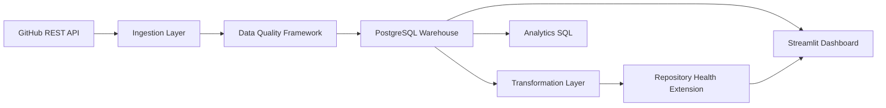
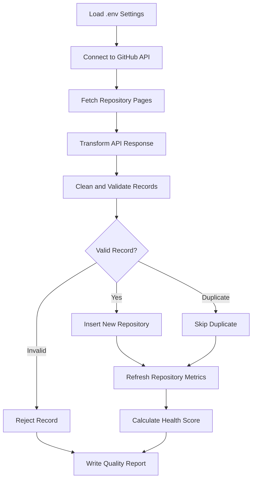
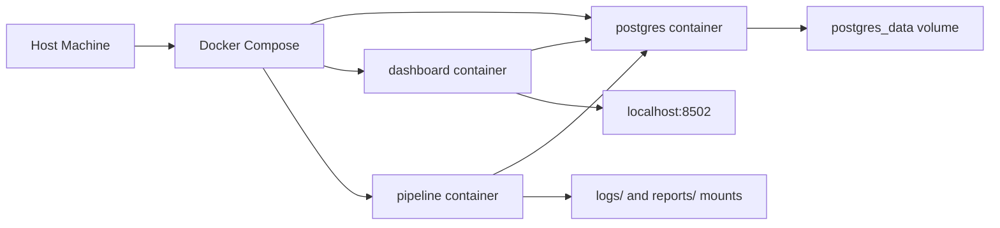

# DataPulse Architecture

DataPulse is organized as a modular data engineering project. Each layer owns a
clear responsibility so the project can grow without rewriting earlier work.

## High-Level Architecture

## ETL Flow

## Docker Architecture

## Data Model Summary

- `repositories`: raw GitHub repository metadata.
- `repository_metrics`: derived analytics metrics from Week 2.
- `repository_health`: health score and category from Week 3.

## Design Principles

- Keep ingestion, persistence, transformation, quality, and dashboard logic
  separate.
- Keep source data and derived analytics data in different tables.
- Use SQLAlchemy ORM for schema ownership and safer persistence.
- Use SQL files for analyst-friendly queries.
- Keep Docker services small and understandable for local portfolio demos.
