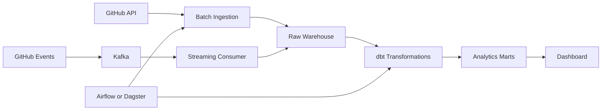

# Third-Year Learning Roadmap

This roadmap shows how DataPulse can grow alongside a third-year data
engineering learning plan.

## Month 1: Python and SQL Depth

- Strengthen Python typing, packaging, and error handling.
- Practice advanced SQL joins, windows, CTEs, and query optimization.
- Add more unit tests and integration tests to DataPulse.
- Learn basic database indexing and query plans.

## Month 2: Data Warehousing

- Study dimensional modeling.
- Add fact and dimension style tables.
- Learn slowly changing dimensions.
- Compare OLTP and OLAP design choices.
- Improve analytics SQL documentation.

## Month 3: dbt and Transformations

- Introduce dbt models for repository metrics.
- Add dbt tests for uniqueness and non-null checks.
- Build staging, intermediate, and mart layers.
- Generate dbt docs.

## Month 4: Orchestration

- Learn Airflow or Dagster.
- Schedule GitHub ingestion.
- Add retries and failure notifications.
- Separate one-time ingestion from scheduled refreshes.

## Month 5: Streaming Foundations

- Learn Kafka concepts: topics, partitions, producers, consumers, and offsets.
- Prototype a repository event stream.
- Compare batch ingestion with streaming ingestion.
- Add event-style tables for repository changes.

## Month 6: CI/CD

- Add GitHub Actions for tests and linting.
- Add dependency checks.
- Build Docker images automatically.
- Add pull request quality gates.

## Month 7: Cloud Deployment

- Deploy PostgreSQL on Neon or another managed database.
- Deploy the dashboard on Streamlit Community Cloud or Render.
- Store secrets in platform secret managers.
- Add deployment documentation and troubleshooting notes.

## Month 8: Observability

- Add structured logs.
- Track pipeline run status.
- Add metrics for records processed, rejected, and stored.
- Create operational dashboard views.

## Month 9: Advanced Analytics

- Improve health scoring with log scaling or percentiles.
- Add trend analysis across multiple ingestion runs.
- Add repository growth metrics.
- Build comparative views by organization and language.

## Month 10: Open Source Readiness

- Improve CONTRIBUTING documentation.
- Add issue templates.
- Add project board.
- Write architecture decision records for major changes.

## Month 11: Portfolio Packaging

- Record a project walkthrough.
- Add dashboard screenshots.
- Prepare interview talking points.
- Write a concise case study.

## Month 12: Capstone Extension

- Add another source system.
- Support scheduled multi-organization ingestion.
- Add a production-style deployment architecture.
- Evaluate whether Kafka, dbt, and orchestration belong in the final version.

## Future Architecture

